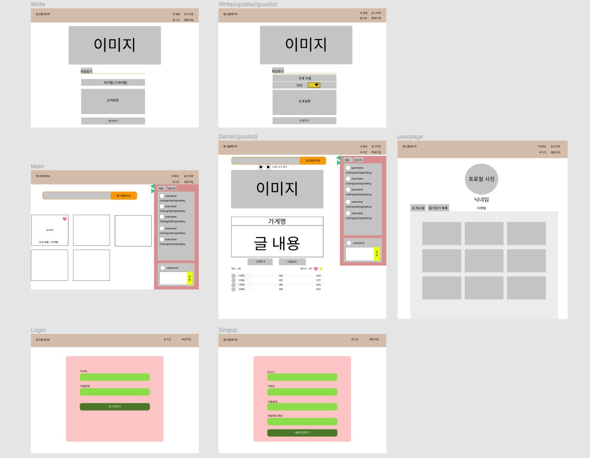
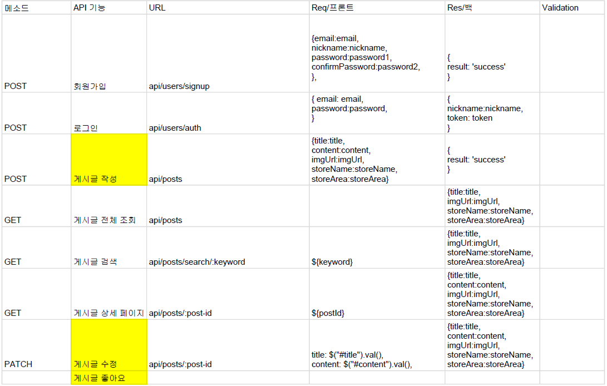
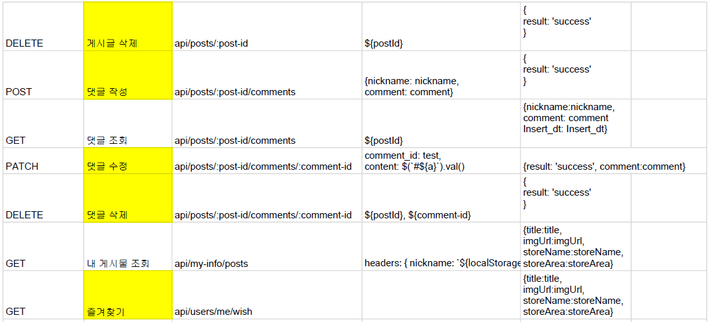

# 항해 4주차 미니프로젝트2

# 해피텅!

### 음식은 두가지로 나뉜다. 내가 먹어본 것, 내가 앞으로 먹어볼 것. 맛집추천과 맛집 찾기를 동시에!😋

# 팀원

Backend

신성웅

허선희

오정민

Frontend

김세연

김현수

김한준

# 와이어프레임

Figma를 이용해 와이어프레임을 설계했습니다!

[https://www.figma.com/file/uUDubcptUhos77TzoODvyP/Untitled?node-id=0%3A1](https://www.figma.com/file/uUDubcptUhos77TzoODvyP/Untitled?node-id=0%3A1)

# API 설계

**user**

POST /api/users/auth

DELETE /api/users/auth

POST /api/users/signup

GET /api/users/me

**posts**

GET /api/posts

POST /api/posts

GET /api/posts/search/:keyword

DELETE /api/posts/:post-id

PATCH /api/posts/:post-id

**comment - controller**

GET /api/posts/:post-id/comments

POST /api/posts/:post-id/comments

DELETE /api/posts/:post-id/comments/:comment-id

PATCH /api/posts/:post-id/comments/:comment-id

## 깃허브 주소

프론트엔드

[https://github.com/geemhunsu/happyTongue-FrontEnd](https://github.com/geemhunsu/happyTongue-FrontEnd)

백엔드

[https://github.com/shinsw627/happyTongue-Back](https://github.com/shinsw627/happyTongue-Back)

### 프론트엔드

### **월요일**

최소단위 컴포넌트 만들기

각자 맡은 페이지 뷰

### 화요일

뷰 끝내기

기능구현

### 수요일

기능구현 끝내기

### 백엔드

### 월요일

DB설계

기능 작업시작

### 화요일

로그인 회원가입 끝내기

기능 라우팅api

### 수요일

게시물 댓글 끝내기

채팅창 끝내기

모든 작업완료!!

## 전체

### 목요일

병합하기

문제점확인

### 금요일

문제점 확인

추가기능 생각하기

### 토요일

마무리 및 정리

동영상제작

회고록 작성
